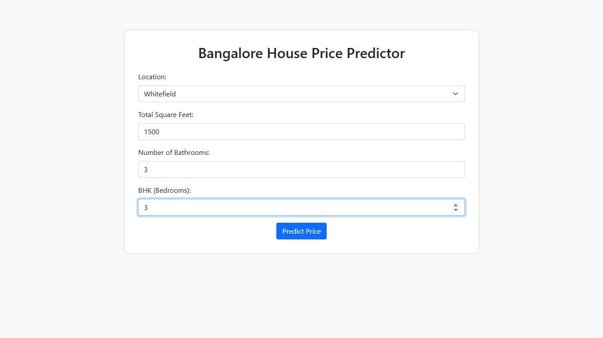
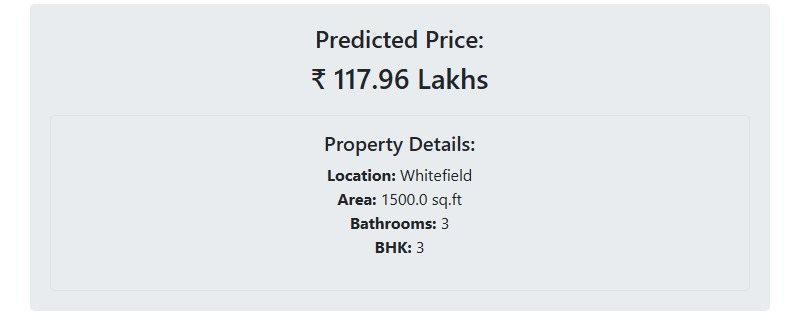
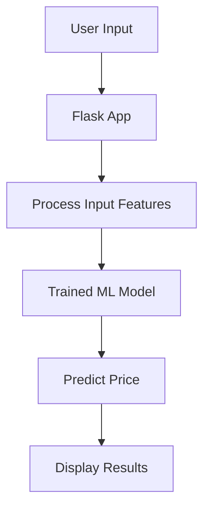

youtube video link:👉  https://www.youtube.com/watch?v=NcmXkE907io

Got it! Let me craft a **detailed README** that aligns with the goals, working, and functionality of your project while also incorporating images, links, and additional requirements. Here’s a revised version:

---

# 🏠 **Real Estate Price Prediction API**

## 🌟 **Project Motto**
This project aims to provide an accurate and interactive **Real Estate Price Prediction tool**. Users can input details such as property location, square footage, number of bedrooms, and bathrooms to get an **instant price prediction** based on a trained **machine learning model**.  

This API bridges the gap between **data science** and **user-friendly deployment**, allowing seamless integration of advanced predictions into real-world applications.  

---

## 💡 **How It Works**

1. **Data Processing & Model Training**  
   - A dataset of real estate transactions was cleaned and processed.  
   - Key features such as `location`, `total_sqft`, `bath`, and `bhk` were selected.  
   - A **Linear Regression model** was trained and stored as a `.pkl` file for deployment.  

2. **Prediction Mechanism**  
   - The trained model is loaded and predicts property prices based on user inputs.  
   - Location data is one-hot encoded to handle categorical features.  

3. **Interactive Frontend**  
   - A Flask-powered web app provides an intuitive interface for predictions.  
   - Users input details via forms, and results are displayed instantly.  

4. **API Integration**  
   - A `/predict` endpoint allows developers to integrate the model with other applications.  

---

## 📷 **Screenshots**
### Home Page


### Prediction Results


---

## 🎥 Watch the Demo
[]

---

## 📂 **Project Structure**

```
real-estate-predictor/
├── app.py               # Main Flask Application
├── templates/           # HTML Templates (index.html, result.html)
├── static/              # Static Assets (CSS, JS, Images)
├── models/              # Trained Model and Features
│   ├── lr_regg.pkl
│   └── feature_names.pkl
├── requirements.txt     # Python Dependencies
├── README.md            # Project Documentation
└── tests/               # Test Scripts
    └── test_predictions.py
```

---

## 🚀 **Features**
- **Accurate Price Predictions** using a trained regression model.  
- **Interactive Web Interface** for user-friendly predictions.  
- **API Integration** for developers to use the model programmatically.  
- **Scalable and Extendable** to new locations or additional features.  

---

## 🛠️ **Installation and Setup**

### Prerequisites  
- Python 3.8+  
- Flask  
- Pickle  

### Installation Steps  
1. Clone the repository:  
   ```bash
   git clone https://github.com/yourusername/real-estate-predictor.git
   cd real-estate-predictor
   ```

2. Create a virtual environment:  
   ```bash
   python -m venv env
   source env/bin/activate  # Linux/Mac
   env\Scripts\activate     # Windows
   ```

3. Install dependencies:  
   ```bash
   pip install -r requirements.txt
   ```

4. Start the Flask application:  
   ```bash
   python app.py
   ```

5. Open your browser and navigate to `http://127.0.0.1:5000/`.  

---

## 🌐 **API Usage**

### Endpoint: `/predict`  
**Method**: `POST`  
**Input** (JSON):  
```json
{
  "location": "Whitefield",
  "sqft": 1200,
  "bath": 2,
  "bhk": 3
}
```

**Output**:  
```json
{
  "predicted_price": 94.23
}
```

---

## 🔍 **Model Details**
The trained model uses **Linear Regression** with key features like:
- **total_sqft**: Total square footage of the property.  
- **bath**: Number of bathrooms.  
- **bhk**: Number of bedrooms.  
- **Location**: One-hot encoded for categorical support.  

---

## 📈 **Future Enhancements**
- Add support for more advanced machine learning models like Random Forest or XGBoost.  
- Improve UI design with frameworks like Bootstrap.  
- Expand location datasets for better predictions.  
- Add real-time price scraping for dynamic updates.  

---

## 🖼️ **Visual Workflow**


---

## 🌟 **Contributions**  
Contributions are welcome! Feel free to fork this repository, open issues, or submit pull requests.

---

## 📄 **License**
This project is licensed under the MIT License.

---

Let me know if you’d like to add your project-specific logos, an updated image, or a link for live hosting once deployed!
